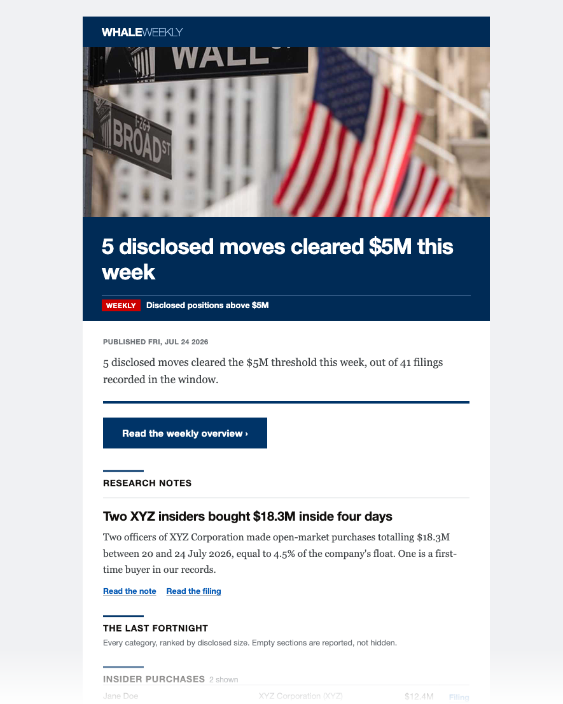
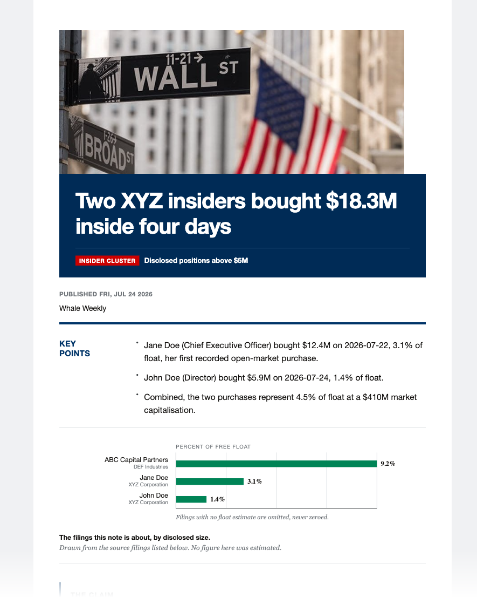
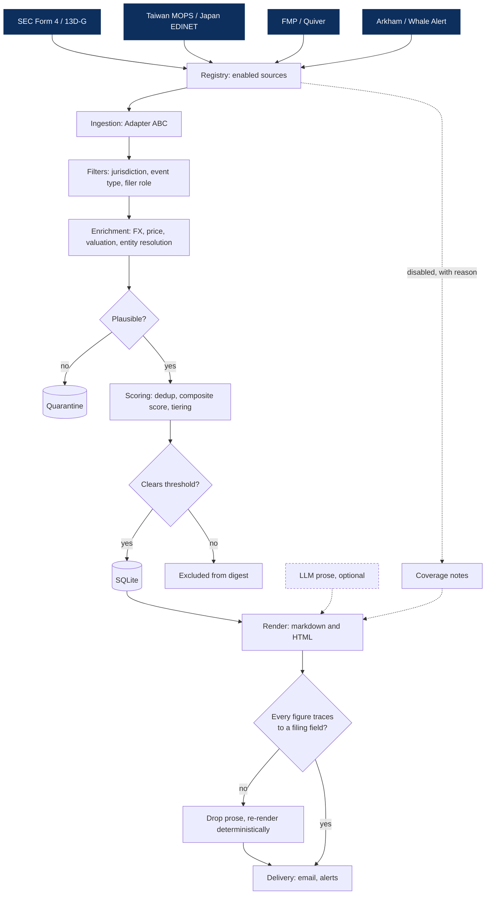

# whale-agent

[](https://github.com/patrickt6/whale-agent/actions/workflows/test.yml)
[](https://github.com/patrickt6/whale-agent/actions/workflows/lint.yml)
[](LICENSE)
[](pyproject.toml)

Site: https://whale-agent.com

<p align="center">
  
  
</p>
<p align="center">
  <sub>Weekly email (left) and a linked research note (right). Placeholder data.</sub>
</p>

Ingests mandatory public investment disclosures, normalizes them to USD, scores them
against a configurable threshold, and emits a daily table and a weekly research note.
Figures are copied from filing fields; sentences containing figures that do not trace to
a field are dropped before delivery.

Not investment advice. See [Scope and limitations](#scope-and-limitations).

## The problem

Insiders, funds and legislators already have to disclose what they buy, and the filings
are public on the day they land. They are also written to different regulators' schemas.
An SEC Form 4, a Japanese EDINET large-shareholding report and a Taiwan MOPS insider
holding share no field names and no currency. Reading them by hand does not scale past a
handful of names, and the number a reader actually wants, how big this was in dollars, is
usually not in the filing at all.

The work is therefore normalization and triage rather than prediction. Put every
disclosure into the same shape, price it, then let a threshold decide what is worth a
person's attention.

## Two minutes, no credentials

```bash
python -m venv .venv && .venv/bin/pip install -e ".[dev]"
make smoke
```

`make smoke` runs the pipeline against a bundled sample with no network and no API keys,
and exits non-zero if no scored row reaches the table:

```
WHALE DIGEST, 2026-09-16
Top move: Jane Q. Example: OPEN-MARKET BUY $7.5M in Acme Micro Corp.

TIER 2: NOTABLE
1. Jane Q. Example: OPEN-MARKET BUY $7.5M in Acme Micro Corp 🇺🇸 (US), 2026-07-24, 0-day lag
   Why: clears the $5M threshold, with nothing else to distinguish it.
   Trading pattern: unknown

Every figure traces to a filing field. Each row's trading-pattern label
(opportunistic/routine/unknown, Cohen-Malloy-Pomorski 2012) is shown for context and does
not affect ranking. Awareness tool, not investment advice.

PASS: sample ingest produced a thresholded USD row in the daily table
```

That is the whole path in one command: ingest, normalize to USD, score against the
threshold, render the table. Sample data, so the names are placeholders, and the heading
carries the date you run it rather than the one above.

## Install

One command on macOS or Linux:

```bash
curl -fsSL https://whale-agent.com/install | sh
```

The script installs [uv](https://docs.astral.sh/uv/) if you do not have it, then runs
`uv tool install whale-agent`. You do not need sudo, and it only writes to your home
directory. If you run it again, it upgrades Whale Agent. When it finishes, run `whale`.

If `~/.local/bin` is not on your PATH, the script prints the line to add to your shell
profile.

Other ways to install:

```bash
npx whale-agent-cli           # Node users; runs whale through uv or pipx
uv tool install whale-agent   # if you already use uv
pipx install whale-agent      # if you already use pipx
```

Each one keeps `whale` in its own environment, away from your other Python packages.
Python 3.11 or newer is required. uv downloads it for you if needed.

The PyPI and npm packages are not published yet. Until they are, install from GitHub:

```bash
curl -fsSL https://whale-agent.com/install \
  | WHALE_INSTALL_SOURCE=git+https://github.com/patrickt6/whale-agent.git sh
```

To work on the code, clone it instead (`WHALE_INSTALL_MODE=source` does the same):

```bash
git clone https://github.com/patrickt6/whale-agent.git
cd whale-agent
python -m venv .venv && .venv/bin/pip install -e ".[dev]"
./whale --help
```

**Where settings go.** In a clone, `whale` uses `.env` in the repo. After a tool install
it uses `./.env` if the current folder has one, and `~/.config/whale-agent/.env`
otherwise. `whale settings` writes to that same file. Scheduled runs log to
`~/Library/Logs/whale-agent` on macOS and `~/.local/state/whale-agent` on Linux.

Run `whale doctor` next. It lists each missing setting and how to fix it.

## CLI

`./whale` with no arguments opens the app in a terminal and runs the daily digest
otherwise (CI). The installed `whale` console script does the same.

| Command | Function |
|---|---|
| `whale app` | Start screen and menu |
| `whale settings` | Settings, grouped as Delivery, Filters, AI writer, Sources, Keys; saved to `.env` |
| `whale doctor [--live]` | Check `.env`, email, SEC contact, source keys, AI writer key; `--live` tries the SMTP login; exits 1 on a blocking problem |
| `whale config` | What is on and off (same as `digest --show-config`) |
| `whale test-email` | Send one test email |
| `whale digest` / `weekly` / `watchdog` | The jobs; extra arguments pass through |
| `whale schedule on [--time HH:MM]` | Send the briefs automatically: launchd on macOS, a marked crontab block on Linux; weekly runs Mondays when `WHALE_CADENCE` includes it |
| `whale schedule off` / `status` | Remove the schedule, or show it; `whale doctor` warns when it is off |
| | Logs go to `logs/schedule-digest.log` and `logs/schedule-weekly.log` |

Watchlist and cadence live in `.env`: `WHALE_WATCH_FILERS` and `WHALE_WATCH_TICKERS`
(comma-separated, blank means no filter) and `WHALE_CADENCE` (`daily`, `weekly`, or
`both`, the default).

## Usage

```bash
./whale digest --demo            # offline, no network or credentials
./whale test                     # test suite, offline
./whale digest --show-config     # effective config and its source layer
cp .env.example .env             # add credentials, then ./whale digest
```

`./whale` sets `PYTHONPATH` and runs from the repo root. Subcommands: `digest`, `weekly`,
`alerts`, `watchdog`, `relabel`, `test`, `python`.

| Command | Function |
|---|---|
| `./whale digest` | Collect, rank, render, email |
| `./whale weekly` | Weekly aggregation and research notes |
| `./whale alerts` | Tier-1 alerts (`--dry-run` supported) |
| `./whale watchdog` | Source freshness and delivery dead-man's switch |

Run the watchdog on a separate schedule from the digest.

## Pipeline



- `registry` resolves which sources run and records why the others did not.
- `ingestion` implements an `Adapter` ABC: fetch, parse, normalize.
- `filters` applies jurisdiction, event type, and filer role narrowing.
- `enrichment` adds FX, price, valuation, entity resolution, routine classification.
- `scoring` deduplicates, computes a composite score, applies the threshold gate, tiers.
- `render` produces markdown and HTML; the provenance gate runs before delivery.
- `storage` is SQLite with idempotent upserts.

## Output guarantees

The LLM receives pre-formatted strings and does not perform arithmetic. Scores are not
exposed to it. After rendering, each sentence containing a figure is checked against the
structured event data; unsourced sentences are dropped and the digest is re-rendered
without prose.

Given a fixed corpus and date, the daily text digest, daily HTML email, weekly report,
and ranking are byte-identical across runs and hash seeds, verified in
`tests/test_determinism.py`. Generated prose is not deterministic (`WHALE_LLM_TEMPERATURE`
defaults to 0.2); figures are unaffected.

Provenance does not imply correctness. `enrichment/plausibility.py` screens figures that
trace correctly but are implausible. Source failures become coverage notes rather than
exceptions, and a failed source is represented differently from one that returned no rows.

The gate fails closed. A send that is attempted and refused exits non-zero rather than
reporting success: a run that delivers nothing must not go green, which is the failure
mode that hides a broken pipeline for a week.

### Why the screen exists

One vendor row valued a position at $1.6 quadrillion. The vendor's `price` field carried
a transaction total rather than a per-share price, so `shares x price` multiplied the
same number by itself. It reached a published table once, and it did so while every
check that could have caught it was already in the codebase and optional at the call
site.

The fix was to make the existing checks non-optional at four independent layers. Each
layer is pinned by a blocking test and by a true-negative test that proves the layer
still passes ordinary data:

| Layer | Blocking test | True negative |
|---|---|---|
| Vendor adapter, at parse time | rejects the bad price | a real per-share price survives |
| Valuation | quarantines the multiplication | still values an ordinary filing |
| Storage read | screened read does not return the row | |
| Delivery egress | blocks a body carrying the figure | lets an ordinary digest through |

`tests/test_quadrillion.py` holds 12 tests across those four layers. The bad row is still
in the corpus on purpose: the screened read path is what keeps it out of output, not
deletion, so the tests exercise the real defence rather than a cleaned-up fixture.

`enrichment/plausibility.py` carries the tolerances this rests on, including a $250B
absolute ceiling, a 1.5x market-cap check and a share-price band of $0.01 to $1,000,000.

## Configuration

Precedence, lowest to highest: defaults, profile file, environment, CLI flags.
`--show-config` prints each effective value and the layer that set it.

```bash
./whale digest --profile us-insiders
./whale digest --profile us-insiders --threshold-usd 250000
./whale digest --profile ./custom.toml
```

| Profile | Configuration |
|---|---|
| `default` | All free sources, $5M threshold |
| `us-insiders` | Form 4 only, $1M, officers and directors, excludes 10% owners |
| `activist` | 13D only, low threshold, first-time filers |
| `crypto` | Arkham and Whale Alert only |

Profiles are TOML files in [`profiles/`](profiles). Unknown keys raise an error with a
suggested correction.

## Sources

Each source requires both an enable flag and a credential. A missing credential disables
the source and adds a coverage note.

| Source | Cost | Requirement |
|---|---|---|
| SEC Form 4, SC 13D/G | Free | `WHALE_SEC_USER_AGENT` contact string |
| Taiwan MOPS (TWSE OpenAPI) | Free | None |
| Dataroma | Free | None; see licensing note in module docstring |
| Japan EDINET | Free | Registered API key |
| Arkham, Whale Alert | Free tier | API key |
| FMP (insider, congress, 13F, prices) | Paid | Subscription |
| Quiver (congress, lobbying, contracts) | Paid | Subscription |
| Finnhub (insider transactions) | Paid | `FINNHUB_API_KEY` and `WHALE_ENABLE_FINNHUB=1` (off by default) |
| Unusual Whales (congressional trades) | Paid | `UNUSUAL_WHALES_API_KEY` and `WHALE_ENABLE_UNUSUAL_WHALES=1` (off by default) |

FMP is also the price provider. Filings reporting share counts or percentages rather than
dollar amounts cannot be valued without it; they are still ingested and stored, and are
valued if FMP is enabled later.

Adding a source requires decorating one builder with `@register_source` in
`ingestion/registry.py`.

## Alerts

Tier-1 alerts fire on three conditions: a position above `WHALE_INSTANT_USD` (default
$100M), a first-time activist 13D by a filer in the notability registry, or three or more
insiders buying the same issuer. Alerts are deduplicated against storage.

## Scope and limitations

This reads disclosures already published by regulators. It is not a trading system and
does not constitute investment advice.

To be explicit: this does not find alpha, and no claim in this repository says it does.
Everything it reads is public by law and already priced in by the time it lands. What it
removes is the manual work between a filing being published and a person seeing it in
dollars, next to everything else filed that day. Every figure here is a normalization or
triage claim rather than a performance claim. The repository contains no backtest and no
return series, so there is nothing in it that could support one.

The weekly report includes a fixed evidence block:

- Insider buys are more informative than sells.
- Historical signal was concentrated in opportunistic rather than routine trades
  (Cohen, Malloy and Pomorski 2012).
- The effect was concentrated in small caps and has decayed since publication.
- 13F data is 45 to 135 days stale, long-only, and excludes shorts and derivatives.
- Chiang et al. (2004) found no reliable abnormal returns for insider trading
  disclosures on the Taiwan Stock Exchange, which is a covered market.


## Not implemented

- Live FX. `StaticFxProvider` ignores the filing date and uses fixed approximate rates,
  so non-USD figures carry error proportional to currency movement since filing. See
  `enrichment/fx.py`.
- Postgres. `DATABASE_URL` is read but `storage/db.py` is SQLite-only.
- Delivery channel selection. `delivery/slack.py` is implemented but not selectable.
- Additional jurisdictions: Korea OpenDART, UK FCA NSM, HKEX, ASX, India NSE/BSE, EU OAMs.

## License

MIT. See [`LICENSE`](LICENSE).

## Website

The project website lives in [`site/`](site). It is plain HTML, CSS and JavaScript: no
build step, no framework, no API keys, and every link is relative.

**Look at it (30 seconds).** Double-click `site/index.html`. It works from the file system.

**Preview it like a real server (1 minute).**

```bash
make site          # then open http://localhost:8731
```

**Publish it for free (under 5 minutes).** Needs Node.js (for `npx`) and a free
Cloudflare account.

```bash
npx wrangler login # once per computer, opens the browser
make site-deploy   # prints the live URL, https://whale-agent-site.<account>.workers.dev
```

`make site-deploy` uploads the `site/` folder as static files on the Cloudflare free
tier (config: [`deploy-site/wrangler.toml`](deploy-site/wrangler.toml)). Run it again
after any change. Everything in `site/` becomes public, so keep secrets, `whale.db` and
generated reports out of that folder.

No Node.js? Any static host works with the same folder. On Cloudflare you can also
upload the `site/` folder by hand from the dashboard (Workers & Pages, create a Pages
project, upload assets).
