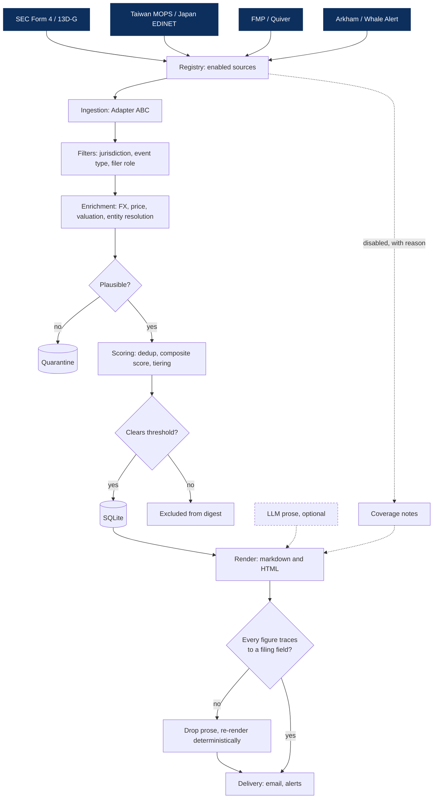

# whale-agent

[](https://github.com/patrickt6/whale-agent/actions/workflows/test.yml)
[](https://github.com/patrickt6/whale-agent/actions/workflows/lint.yml)
[](LICENSE)
[](pyproject.toml)

<p align="center">
  
  
</p>
<p align="center">
  <sub>Weekly email (left) and a linked research note (right). Placeholder data.</sub>
</p>

Ingests mandatory public investment disclosures, normalizes them to USD, scores them
against a configurable threshold, and emits a daily table and a weekly research note.
Figures are copied from filing fields; sentences containing figures that do not trace to
a field are dropped before delivery.

Not investment advice. See [Scope and limitations](#scope-and-limitations).

## Install

Requires Python 3.11+.

```bash
python -m venv .venv && .venv/bin/pip install -e ".[dev]"
```

## Usage

```bash
./whale digest --demo            # offline, no network or credentials
./whale test                     # test suite, offline
./whale digest --show-config     # effective config and its source layer
cp .env.example .env             # add credentials, then ./whale digest
```

`./whale` sets `PYTHONPATH` and runs from the repo root. Subcommands: `digest`, `weekly`,
`alerts`, `watchdog`, `relabel`, `test`, `python`.

| Command | Function |
|---|---|
| `./whale digest` | Collect, rank, render, email |
| `./whale weekly` | Weekly aggregation and research notes |
| `./whale alerts` | Tier-1 alerts (`--dry-run` supported) |
| `./whale watchdog` | Source freshness and delivery dead-man's switch |

Run the watchdog on a separate schedule from the digest.

## Pipeline



- `registry` resolves which sources run and records why the others did not.
- `ingestion` implements an `Adapter` ABC: fetch, parse, normalize.
- `filters` applies jurisdiction, event type, and filer role narrowing.
- `enrichment` adds FX, price, valuation, entity resolution, routine classification.
- `scoring` deduplicates, computes a composite score, applies the threshold gate, tiers.
- `render` produces markdown and HTML; the provenance gate runs before delivery.
- `storage` is SQLite with idempotent upserts.

## Output guarantees

The LLM receives pre-formatted strings and does not perform arithmetic. Scores are not
exposed to it. After rendering, each sentence containing a figure is checked against the
structured event data; unsourced sentences are dropped and the digest is re-rendered
without prose.

Given a fixed corpus and date, the daily text digest, daily HTML email, weekly report,
and ranking are byte-identical across runs and hash seeds, verified in
`tests/test_determinism.py`. Generated prose is not deterministic (`WHALE_LLM_TEMPERATURE`
defaults to 0.2); figures are unaffected.

Provenance does not imply correctness. `enrichment/plausibility.py` screens figures that
trace correctly but are implausible. Source failures become coverage notes rather than
exceptions, and a failed source is represented differently from one that returned no rows.

## Configuration

Precedence, lowest to highest: defaults, profile file, environment, CLI flags.
`--show-config` prints each effective value and the layer that set it.

```bash
./whale digest --profile us-insiders
./whale digest --profile us-insiders --threshold-usd 250000
./whale digest --profile ./custom.toml
```

| Profile | Configuration |
|---|---|
| `default` | All free sources, $5M threshold |
| `us-insiders` | Form 4 only, $1M, officers and directors, excludes 10% owners |
| `activist` | 13D only, low threshold, first-time filers |
| `crypto` | Arkham and Whale Alert only |

Profiles are TOML files in [`profiles/`](profiles). Unknown keys raise an error with a
suggested correction.

## Sources

Each source requires both an enable flag and a credential. A missing credential disables
the source and adds a coverage note.

| Source | Cost | Requirement |
|---|---|---|
| SEC Form 4, SC 13D/G | Free | `WHALE_SEC_USER_AGENT` contact string |
| Taiwan MOPS (TWSE OpenAPI) | Free | None |
| Dataroma | Free | None; see licensing note in module docstring |
| Japan EDINET | Free | Registered API key |
| Arkham, Whale Alert | Free tier | API key |
| FMP (insider, congress, 13F, prices) | Paid | Subscription |
| Quiver (congress, lobbying, contracts) | Paid | Subscription |

FMP is also the price provider. Filings reporting share counts or percentages rather than
dollar amounts cannot be valued without it; they are still ingested and stored, and are
valued if FMP is enabled later.

Adding a source requires decorating one builder with `@register_source` in
`ingestion/registry.py`.

## Alerts

Tier-1 alerts fire on three conditions: a position above `WHALE_INSTANT_USD` (default
$100M), a first-time activist 13D by a filer in the notability registry, or three or more
insiders buying the same issuer. Alerts are deduplicated against storage.

## Scope and limitations

This reads disclosures already published by regulators. It is not a trading system and
does not constitute investment advice.

The weekly report includes a fixed evidence block:

- Insider buys are more informative than sells.
- Historical signal was concentrated in opportunistic rather than routine trades
  (Cohen, Malloy and Pomorski 2012).
- The effect was concentrated in small caps and has decayed since publication.
- 13F data is 45 to 135 days stale, long-only, and excludes shorts and derivatives.
- Chiang et al. (2004) found no reliable abnormal returns for insider trading
  disclosures on the Taiwan Stock Exchange, which is a covered market.


## Not implemented

- Live FX. `StaticFxProvider` ignores the filing date and uses fixed approximate rates,
  so non-USD figures carry error proportional to currency movement since filing. See
  `enrichment/fx.py`.
- Postgres. `DATABASE_URL` is read but `storage/db.py` is SQLite-only.
- Delivery channel selection. `delivery/slack.py` is implemented but not selectable.
- Additional jurisdictions: Korea OpenDART, UK FCA NSM, HKEX, ASX, India NSE/BSE, EU OAMs.

## License

MIT. See [`LICENSE`](LICENSE).
